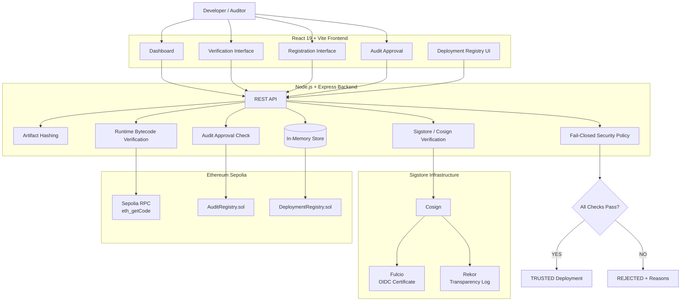
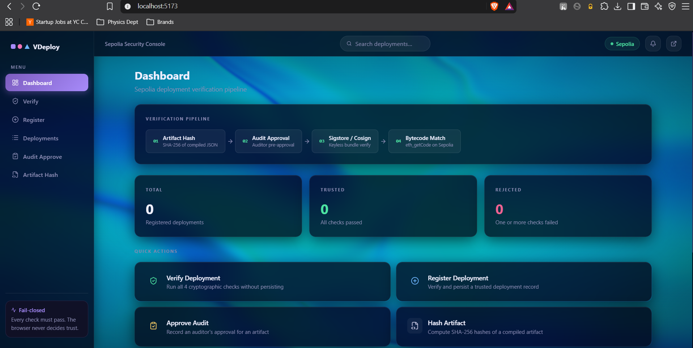
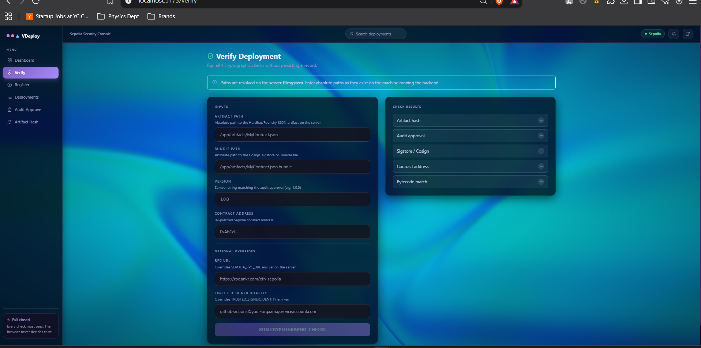

# 🔐 Verifiable Smart Contract Deployer

### A Cryptographic Security Gate for Sepolia Smart Contract Deployments

The **Verifiable Smart Contract Deployer** is a full-stack security gate designed to establish cryptographic trust between a compiled smart-contract artifact, its audit approval, its signed build provenance, and the bytecode actually deployed on the Ethereum Sepolia testnet.

A deployment is marked **TRUSTED only when all four verification stages pass**:

```text
Compiled Artifact
       │
       ▼
  SHA-256 Hash
       │
       ▼
 Audit Approval
       │
       ▼
Sigstore / Cosign
 Verification
       │
       ▼
On-Chain Bytecode
    Comparison
       │
       ▼
    TRUSTED
```

The system follows a **fail-closed security model**: if any verification step fails, the deployment is rejected rather than partially trusted.

---


---

#  Architecture


### System Architecture



---

##  Key Features

*  **Cryptographic artifact hashing** using SHA-256
*  **Auditor pre-approval** for the exact artifact hash and version
*  **Keyless Sigstore/Cosign verification**
*  **Fulcio + Rekor based build provenance**
*  **Live Sepolia bytecode verification** using `eth_getCode`
*  **Fail-closed verification pipeline**
*  **Trusted deployment registry**
*  **Deployment lookup by contract address**
*  **Dashboard for verification and deployment status**
*  Solidity-based `AuditRegistry` and `DeploymentRegistry`

#  Verification Pipeline

Every deployment passes through four security checks.

```text
┌─────────────────────┐
│  1. Artifact Hash   │
│      SHA-256        │
└──────────┬──────────┘
           ↓
┌─────────────────────┐
│ 2. Audit Approval   │
│ Hash + Version      │
└──────────┬──────────┘
           ↓
┌─────────────────────┐
│ 3. Sigstore/Cosign  │
│ Keyless Verification│
└──────────┬──────────┘
           ↓
┌─────────────────────┐
│ 4. Bytecode Match   │
│   eth_getCode       │
└──────────┬──────────┘
           ↓
      ┌─────────┐
      │ TRUSTED │
      └─────────┘
```

### 1. Artifact Hashing

The backend reads the compiled Hardhat/Foundry artifact and generates SHA-256 digests for:

* Raw artifact file
* Creation bytecode
* Runtime bytecode

The runtime bytecode hash becomes the expected value for the final on-chain verification.

### 2. Audit Approval

Before a deployment can become trusted, an auditor must approve the exact:

```text
(artifactHash, version)
```

The approval check verifies that an appropriate audit record exists for that exact artifact/version pair.

### 3. Sigstore / Cosign Verification

The backend verifies a keyless Sigstore bundle using Cosign.

The verification checks:

* Trusted OIDC issuer
* Trusted signer identity
* Artifact signature
* Sigstore bundle
* Fulcio certificate
* Rekor transparency information

Keyless signing uses short-lived certificates associated with an OIDC identity and transparency logging through Rekor.

### 4. On-Chain Bytecode Verification

Finally, the backend queries the Sepolia blockchain using:

```text
eth_getCode(address)
```

The returned runtime bytecode is hashed and compared with the runtime bytecode hash generated from the approved artifact:

```text
SHA-256(eth_getCode(address))
        ==
SHA-256(deployedBytecode.object)
```

If the hashes differ, the deployment is rejected.

---

#  Fail-Closed Security Model

The system does not partially trust a deployment.

A deployment is rejected if:

* Artifact hashing fails
* Audit approval is missing
* Cosign is unavailable
* Sigstore bundle is missing
* Trusted identity is not configured
* OIDC issuer is not configured
* Signature verification fails
* Sepolia RPC fails
* No contract bytecode exists at the address
* Runtime bytecode does not match
* Duplicate deployment registration is attempted

This ensures that incomplete verification never silently results in a trusted record.

---


#  Backend API

| Method | Endpoint                    | Purpose                                  |
| ------ | --------------------------- | ---------------------------------------- |
| `POST` | `/api/artifacts/hash`       | Calculate SHA-256 artifact hashes        |
| `POST` | `/api/audit/approve`        | Approve an artifact/version              |
| `POST` | `/api/sigstore/verify`      | Verify a Cosign bundle                   |
| `POST` | `/api/deploy/verify`        | Run the complete verification pipeline   |
| `POST` | `/api/deployments`          | Verify and register a deployment         |
| `GET`  | `/api/deployments`          | List trusted/rejected deployment records |
| `GET`  | `/api/deployments/:address` | Find a deployment by address             |

A successful deployment record contains information such as:

```text
contractAddress
chainId
artifactHash
runtimeBytecodeHash
version
signerIdentity
auditApproved
sigstoreVerified
bytecodeVerified
status
reasons[]
```

The documented API and deployment record structure are defined in the project specification.

---

#  Smart Contracts

## AuditRegistry.sol

Stores auditor approvals for artifact/version pairs.

Core functionality:

```text
approveArtifact()
revokeApproval()
isApproved()
```

Access is controlled through OpenZeppelin `AccessControl`, with dedicated auditor/admin roles.

## DeploymentRegistry.sol

Stores deployment records indexed by:

```text
keccak256(contractAddress, chainId)
```

It also references the `AuditRegistry` through `IAuditRegistry` and stores additional deployment metadata and verification flags.

---

#  Application Screenshots

### Dashboard



### Deployment Verification



> Add your actual project screenshots to `docs/images/` using the filenames above.

The frontend contains Dashboard, Verify, Register, Deployments, Audit Approval, and Artifact Hash interfaces.

---

#  Project Structure

```text
verifiable-deployer/
│
├── backend/
│   └── src/
│       ├── controllers/
│       ├── services/
│       │   ├── artifact hashing
│       │   ├── Sigstore verification
│       │   └── deployment validation
│       └── db/
│           └── in-memory store
│
├── frontend/
│   └── src/
│       ├── components/
│       ├── pages/
│       │   ├── Dashboard
│       │   ├── Verify
│       │   ├── Register
│       │   ├── Deployments
│       │   ├── Audit
│       │   └── Artifact
│       └── api.ts
│
├── contracts/
│   ├── AuditRegistry.sol
│   └── DeploymentRegistry.sol
│
├── .env.example
└── README.md
```

---

#  Technology Stack

| Layer              | Technology        |
| ------------------ | ----------------- |
| Frontend           | React 19 + Vite   |
| Styling            | Tailwind CSS      |
| Backend            | Node.js + Express |
| Language           | TypeScript        |
| Ethereum Client    | viem              |
| Blockchain         | Ethereum Sepolia  |
| Signing            | Sigstore / Cosign |
| Smart Contracts    | Solidity          |
| Contract Libraries | OpenZeppelin      |
| WebGL              | ogl / Iridescence |

The project's documented stack includes Node.js/Express, TypeScript, viem, Cosign/Sigstore, React/Vite, Tailwind CSS, ogl, Solidity and OpenZeppelin.

---

#  Getting Started

### 1. Clone the repository

```bash
git clone <your-repository-url>
cd verifiable-deployer
```

### 2. Configure environment variables

```bash
cp .env.example .env
```

Configure:

```env
SEPOLIA_RPC_URL=
TRUSTED_SIGNER_IDENTITY=
TRUSTED_OIDC_ISSUER=
```

### 3. Install dependencies

```bash
pnpm install
```

### 4. Build

```bash
pnpm build
```

### 5. Start the backend

```bash
pnpm dev:backend
```

### 6. Start the frontend

```bash
pnpm dev:frontend
```

---

#  Creating a Keyless Sigstore Bundle

A keyless Cosign bundle can be generated through GitHub Actions:

```bash
cosign sign-blob --yes \
  --bundle artifact.bundle \
  artifact.json
```

The resulting bundle is supplied to the verification API together with:

```text
Artifact path
Bundle path
Version
Deployed Sepolia address
```

Only a deployment passing the complete verification pipeline can be registered.

---

#  Security Considerations

### Threat → Mitigation

| Threat                  | Mitigation                          |
| ----------------------- | ----------------------------------- |
| Tampered artifact       | SHA-256 artifact verification       |
| Unauthorized deployment | Auditor approval                    |
| Wrong signing identity  | Cosign + OIDC identity verification |
| Supply-chain compromise | Sigstore/Fulcio/Rekor verification  |
| Bytecode substitution   | `eth_getCode` runtime comparison    |
| Duplicate registration  | `(address, chainId)` uniqueness     |

These mitigations correspond to the project's documented security analysis.

---

#  Current Limitations

This is currently a reference/demo implementation.

* In-memory records are lost after restart.
* API authentication and rate limiting are not implemented.
* `cosign` must be available in the system `PATH`.
* The chain ID is currently fixed to Sepolia `11155111`.
* The Solidity registries are not yet wired directly into the backend persistence layer.

These limitations are documented in the project specification.

For production deployment, the project should use a persistent database, authentication/authorization, rate limiting, secure secret management, and direct integration with the Solidity registries.

---

#  Future Improvements

* [ ] PostgreSQL / production database
* [ ] Backend authentication and RBAC
* [ ] Direct on-chain registry integration
* [ ] Multi-network support
* [ ] Automated CI/CD verification
* [ ] GitHub Actions integration
* [ ] Deployment history and audit trails
* [ ] Cryptographic proof export
* [ ] Automated security alerts
* [ ] Production-grade observability and logging

---

#  Security Philosophy

The core principle of the project is:

> **A deployment should only be trusted when its artifact, audit approval, signature, and on-chain bytecode all agree.**

This creates a cryptographic chain of custody from the compiled artifact to the contract actually deployed on Sepolia.

---

#  Team

**Team SoanPapdi**

Built as a security-focused reference implementation for verifiable smart-contract deployments.

---

##  References

1. [Sigstore Project](https://www.sigstore.dev/)
2. [Cosign](https://github.com/sigstore/cosign)
3. [OpenZeppelin Contracts](https://docs.openzeppelin.com/contracts/)
4. [viem](https://viem.sh/)
5. [Ethereum Sepolia](https://sepolia.dev/)
6. [Ethereum Whitepaper](https://ethereum.org/en/whitepaper/)
